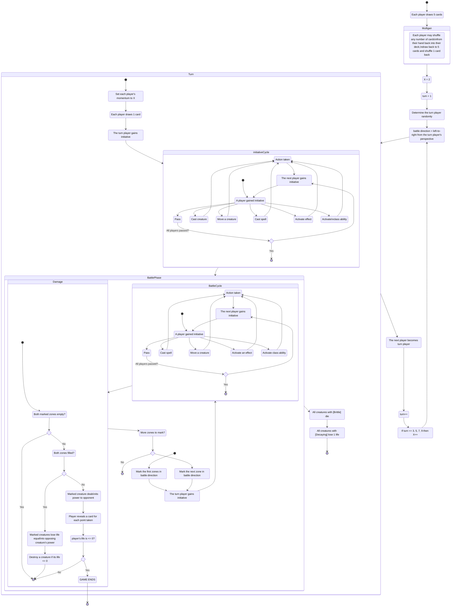

```mermaid
stateDiagram-v2
	startDraw: Each player draws 5 cards
	state Mulligan
	{
		mulligan: Each player may shuffle any number of cards\nfrom their hand back into their deck,\ndraw back to 5 cards and shuffle 1 card back
	}
	startSetX: X = 2
	startSetTurn: turn = 1
	startTurnPlayer: Determine the turn player randomly
	startBattleDirection: battle direction = left-to-right from the turn player's perspective
	state initiativeCycle
	{
		actionTaken: Action taken
		state allPassedCheck <<choice>>
		gainedInitiative: A player gained initiative
		nextInitiative: The next player gains initiative
		castCreature: Cast creature
		castSpell: Cast spell
		activateEffect: Activate effect
		activateClass: Activate\nclass ability
		moveCreature: Move a creature

		[*] --> gainedInitiative
		gainedInitiative --> Pass
		gainedInitiative --> castCreature
		gainedInitiative --> moveCreature
		castCreature --> actionTaken
		moveCreature --> actionTaken
		gainedInitiative --> castSpell
		castSpell --> actionTaken
		gainedInitiative --> activateEffect
		activateEffect --> actionTaken
		gainedInitiative --> activateClass
		activateClass --> actionTaken
		Pass --> allPassedCheck: All players passed?
		actionTaken --> nextInitiative
		allPassedCheck --> [*]: Yes
		allPassedCheck --> nextInitiative
		nextInitiative --> gainedInitiative
	}
	state BattleCycle
	{
		battleActionTaken: Action taken
		state battleAllPassedCheck <<choice>>
		battleGainedInitiative: A player gained initiative
		battleNextInitiative: The next player gains initiative
		battlePass: Pass
		battleCastSpell: Cast spell
		battleMove: Move a creature
		battleActivate: Activate an effect
		battleClass: Activate class ability

		[*] --> battleGainedInitiative
		battleGainedInitiative --> battlePass
		battleGainedInitiative --> battleCastSpell
		battleCastSpell --> battleActionTaken
		battleGainedInitiative --> battleMove
		battleMove --> battleActionTaken
		battleGainedInitiative --> battleActivate
		battleActivate --> battleActionTaken
		battleGainedInitiative --> battleClass
		battleClass --> battleActionTaken
		battlePass --> battleAllPassedCheck: All players passed?
		battleActionTaken --> battleNextInitiative
		battleAllPassedCheck --> [*]: Yes
		battleAllPassedCheck --> battleNextInitiative
		battleNextInitiative --> battleGainedInitiative
	}
	state Damage
	{
		empty: Both marked zones empty?
		state emptyCheck <<choice>>
		bothZones: Both zones filled?
		state bothZonesCheck <<choice>>
		calculateNewStats: Marked creatures lose life equal\nto opposing creature's power
		doDamage: Marked creature deals\nits power to opponent
		creatureDeath: Destroy a creature if its life <= 0
		playerDeath: player's life is <= 0?
		state playerDeathCheck <<choice>>
		reveal: Player reveals a card for each point taken

		[*] --> empty
		empty --> emptyCheck
		emptyCheck --> [*]: Yes
		emptyCheck --> bothZones: No
		bothZones --> bothZonesCheck
		bothZonesCheck --> calculateNewStats: Yes
		bothZonesCheck --> doDamage: No
		calculateNewStats --> creatureDeath
		creatureDeath --> [*]
		doDamage --> reveal
		reveal --> playerDeath
		playerDeath --> playerDeathCheck
		playerDeathCheck --> gameEnds: Yes
		playerDeathCheck --> [*]: No
	}
	state BattlePhase
	{
		markFirstZone: Mark the first zones in battle direction
		setInitiative: The turn player gains initiative
		lastZone: More zones to mark?
		state lastZoneCheck <<choice>>
		markNextZone: Mark the next zone in battle direction

		[*] --> markFirstZone
		markFirstZone --> setInitiative
		setInitiative --> BattleCycle
		BattleCycle --> Damage
		Damage --> lastZone
		lastZone --> lastZoneCheck
		lastZoneCheck --> [*]: No
		lastZoneCheck --> markNextZone
		markNextZone --> setInitiative
	}
	state Turn
	{
		turnSetMomentum: Set each player's momentum to X
		turnDraw: Each player draws 1 card
		turnPlayerInitiative: The turn player gains initiative
		resolveBrittle: All creatures with [Brittle] die
		resolveDecaying: All creatures with [Decaying] lose 1 life

		[*] --> turnSetMomentum
		turnSetMomentum --> turnDraw
		turnDraw --> turnPlayerInitiative
		turnPlayerInitiative --> initiativeCycle
		initiativeCycle --> BattlePhase
		BattlePhase --> resolveBrittle
		resolveBrittle --> resolveDecaying
		resolveDecaying --> [*]
	}
	gameEnds: GAME ENDS
	nextTurnPlayer: The next player becomes turn player
	incTurnCount: turn++
	incMomentum: If turn == 3, 5, 7, 9 then X++

	[*] --> startDraw
	startDraw --> Mulligan
	Mulligan --> startSetX
	startSetX --> startSetTurn
	startSetTurn --> startTurnPlayer
	startTurnPlayer --> startBattleDirection
	startBattleDirection --> Turn
	Turn --> nextTurnPlayer
	nextTurnPlayer --> incTurnCount
	incTurnCount --> incMomentum
	incMomentum --> startBattleDirection
	gameEnds --> [*]
```
